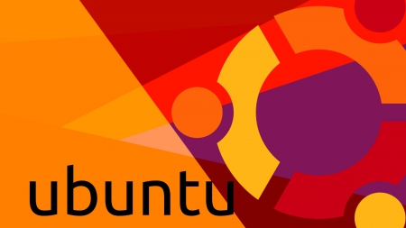

# Ubuntu Bytes
This is a collection of guides, tools and tips to use in Ubuntu.

 

 

## Table of contents
1. [Install Nodejs](/README.md#install-nodejs)
2. [Install VS Code](/README.md#install-visual-studio-code)

### Install Nodejs

##### Simplifed
1. Get the latest nodejs package from [here](https://nodejs.org/en/download/current/) based on your system architecture (x86/x64)
2. open terminal window from the downloaded package location
3. Install _xz-utils_ `sudo apt-get install xz-utils`
4. Install _nodejs_ `sudo tar -C /usr/local --strip-components 1 -xJf node-v{x}.{x}.{x}-linux-x64.tar.xz`

##### Detailed
1. [How To Install Node.js on an Ubuntu 14.04 server](https://www.digitalocean.com/community/tutorials/how-to-install-node-js-on-an-ubuntu-14-04-server)

### Install Visual Studio Code

##### Dependencies
1. _Git_ `sudo apt-get install git`

##### Simplifed
1. Download `.deb` package of _VS Code_ from [here](https://code.visualstudio.com/Download) based on your system architecture (x86/x64)
2. open terminal window from the downloaded package location
3. Install _VS Code_ `sudo dpkg -i vscode-amd64.deb`
